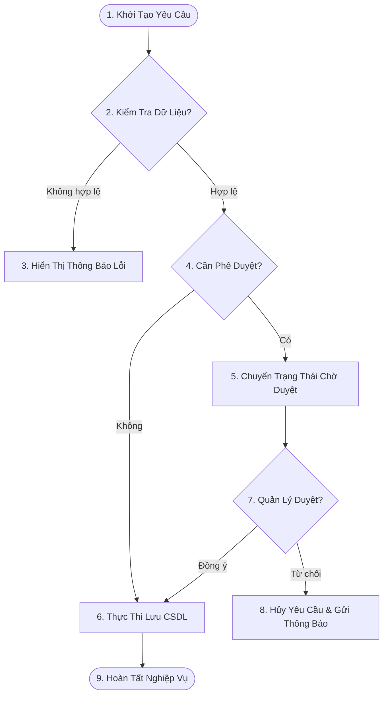

# UniManage Business Analysis (BA) & Requirements Engineering Skill

## Overview

Skill này hướng dẫn Business Analyst (BA) / Product Owner (PO) quy chuẩn phân tích yêu cầu nghiệp vụ, lập tài liệu BRD/SRS, viết User Stories kèm điều kiện nghiệm thu Gherkin (`Given - When - Then`) và vẽ sơ đồ quy trình nghiệp vụ Mermaid cho hệ thống UniManage.

---

## 1. Mẫu Cấu Trúc User Story & Acceptance Criteria (Gherkin Format)

Mọi yêu cầu tính năng **BẮT BỘC** viết theo định dạng chuẩn:

```markdown
### User Story: [Tên Tính Năng]

**Mô tả**:
Là một `<Vai trò người dùng - Role>`,
Tôi muốn `<Hành động / Chức năng - Action>`,
Để `<Mục đích / Giá trị mang lại - Benefit>`.

---

### Acceptance Criteria (Điều Kiện Nghiệm Thu)

#### Kịch Bản 1: [Tên kịch bản thành công]
- **Given** [Tiền điều kiện / Bối cảnh hệ thống]
- **When** [Thao tác của người dùng trên giao diện]
- **Then** [Kết quả kỳ vọng của hệ thống]

#### Kịch Bản 2: [Tên kịch bản ngoại lệ / Lỗi Validation]
- **Given** [Tiền điều kiện]
- **When** [Người dùng nhập sai hoặc thiếu dữ liệu]
- **Then** [Hệ thống chặn gửi form và hiển thị thông báo lỗi chi tiết]
```

---

## 2. Quy Chuẩn Vẽ Sơ Đồ Luồng Nghiệp Vụ (Business Process Flowchart)

Tất cả luồng nghiệp vụ trong tài liệu BRD/SRS sử dụng **Mermaid diagram**:



---

## 3. Ma Trận Quyền Hạn (RACI Matrix Template)

| Chức năng / Tính năng | Business Analyst (BA) | Developer (DEV) | QA / Tester | Product Owner (PO) |
| :--- | :---: | :---: | :---: | :---: |
| **Phân tích BRD/SRS** | **A / R** | C | C | I |
| **Thiết kế API & CSDL** | C | **A / R** | C | I |
| **Viết Mã Nguồn UI/API** | I | **A / R** | I | I |
| **Viết E2E Test Spec** | C | C | **A / R** | I |
| **Nghiệm Thu (UAT Sign-off)**| C | I | C | **A / R** |

*(Ghi chú: R = Responsible, A = Accountable, C = Consulted, I = Informed)*

---

## 4. Checklist Đánh Giá Yêu Cầu Nghiệp Vụ (INVEST Checklist)

Mọi User Story trước khi chuyển sang cho DEV/QA làm việc phải thỏa mãn tiêu chuẩn **INVEST**:
- [ ] **Independent**: Tính năng độc lập, không phụ thuộc cứng vào story chưa phát triển.
- [ ] **Negotiable**: Dễ dàng thảo luận và điều chỉnh cùng nhóm phát triển.
- [ ] **Valuable**: Mang lại giá trị nghiệp vụ rõ ràng cho doanh nghiệp.
- [ ] **Estimable**: Đủ thông tin để lập trình viên ước lượng thời gian thực hiện (Story Points).
- [ ] **Small**: Kích thước vừa phải (thực hiện xong trong phạm vi 1 Sprint).
- [ ] **Testable**: Có Acceptance Criteria rõ ràng để QA viết kịch bản test.
