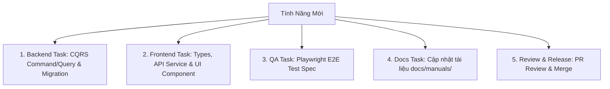

# UniManage Project Lead & Tech Lead Skill

## Overview

Skill này quy định nhiệm vụ, quy trình quản lý dự án, lập kế hoạch Sprint, điều phối công việc và kiểm soát chất lượng kỹ thuật dành cho **Project Lead (PL) / Technical Lead (Tech Lead)** trong dự án UniManage.

---

## 1. Vai Trò & Trách Nhiệm Của Project Lead (PL)

1. **Quản Lý Kế Hoạch & Tiến Độ (Agile/Scrum)**:
   - Tổ chức các buổi Lập kế hoạch Sprint (Sprint Planning), Họp hằng ngày (Daily Standup) và Tổng kết Sprint (Sprint Review / Retrospective).
   - Phân rã User Stories từ BA thành các Task kỹ thuật cụ thể cho Dev/QA.
2. **Quản Trị Kiến Trúc & Chất Lượng Mã Nguồn (Code Governance)**:
   - Duyệt các kiến trúc đề xuất (Clean Architecture, CQRS, Database Schema changes).
   - Thực hiện Code Review (Peer Review) đối với các Pull Request trước khi Merge vào nhánh `develop`/`main`.
3. **Quản Lý Rủi Ro & Giải Quyết Điểm Nghẽn (Blocker Resolution)**:
   - Phát hiện các rủi ro kỹ thuật (Technical Debt, lỗi hiệu năng CSDL, xung đột nhánh Git) và đưa ra phương án xử lý kịp thời.
4. **Phát Hành Phiên Bản (Release Management)**:
   - Kiểm soát danh mục tính năng cho từng bản Release v1.x, duyệt Release Checklist và ký duyệt phát hành Production.

---

## 2. Quy Trình Phân Rã Công Việc (Work Breakdown Structure - WBS)

Khi tiếp nhận 1 tính năng mới từ BA, PL thực hiện phân rã thành 5 hạng mục công việc chuẩn:



---

## 3. Quy Trình Review Pull Request (Code Review Checklist)

Khi thành viên tạo Pull Request (PR), PL bắt buộc kiểm tra theo các chỉ tiêu sau:

- [ ] **Kiến trúc CQRS**: Command/Query triển khai đúng `ILoggableCommand`, Controller không chứa logic nghiệp vụ.
- [ ] **Validator**: Logic kiểm tra dữ liệu được gom nhóm chuẩn tại file Validator của mô-đun.
- [ ] **Frontend Component Wrapper**: Không import trực tiếp từ `@heroui/react` tại trang feature, sử dụng wrapper tại `@/components/common`.
- [ ] **i18n & Hardcode Text**: Tuyệt đối không hardcode text hiển thị, sử dụng `t('key')` và khai báo đủ file `vi.json` / `en.json`.
- [ ] **Documentation**: Đã bổ sung XML/JSDoc comments bằng Tiếng Anh cho các hàm mới.
- [ ] **Test Coverage**: Có kịch bản E2E Test Playwright đi kèm và pass 100% trên CI/CD.

---

## 4. Mẫu Báo Cáo Tiến Độ Dự Án (Project Status Report Template)

```markdown
### 📊 Báo Cáo Tiến Độ Sprint [Số Sprint] - Dự Án UniManage

**1. Tổng Quan Tiến Độ**:
- **Tổng số Story Points**: [Kế hoạch] / [Đã hoàn thành] (Đạt ...%)
- **Trạng thái Sprint**: [Đúng tiến độ / Trễ hạn]

**2. Kết Quả Theo Mô-Đun**:
- ✅ **System Module**: Đã hoàn thành 100% các API User/Role & UI HeroUI.
- 🔄 **Sales Module**: Đang ghép API Báo giá (Đạt 80%).
- ⏳ **HR Module**: Chờ nghiệm thu CSDL từ DBA.

**3. Rủi Ro & Điểm Nghẽn (Blockers)**:
- *Rủi ro 1*: Hiệu năng truy vấn SQL báo cáo lớn ➔ *Giải pháp*: Chuyển từ EF Core sang Dapper query & tạo Clustered Index.

**4. Kế Hoạch Tuần Tiếp Theo**:
- Tiến hành nghiệm thu Staging và chuẩn bị Release v1.2.
```
