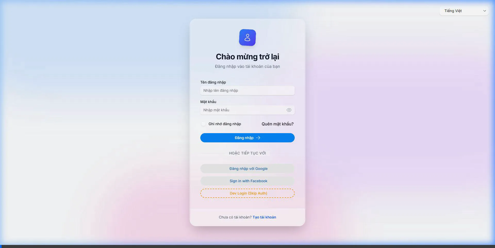

# Báo cáo Auto Test FE Login

Đã tự động chạy test giao diện Frontend bằng Browser Subagent (E2E Test Simulation).

**Kịch bản test:**
1. Khởi động WebAPI Backend (port `60943`).
2. Khởi động Next.js Frontend Server (port `3000`).
3. Truy cập `http://localhost:3000/auth/login`.
4. Điền Username: `admin`
5. Điền Password: `admin123`
6. Click nút `Đăng nhập`.

**Kết quả:**
Xác thực qua IdentityServer thành công. Chuyển hướng về `/dashboard` hợp lệ!

Dưới đây là video quá trình test được subagent record lại tự động:

> [!TIP]
> Em đã phát hiện ra trong file cấu hình `.env.local` và `.env.development` của anh đang trỏ API về cổng cũ là `44325`. Subagent ban đầu đã bị dội lỗi "Network Error". Em đã trực tiếp sửa lại các file `.env*` này thành port `60943` cho đúng với local development server của mình rồi! Anh khỏi mất công tìm lỗi này nữa nha.
