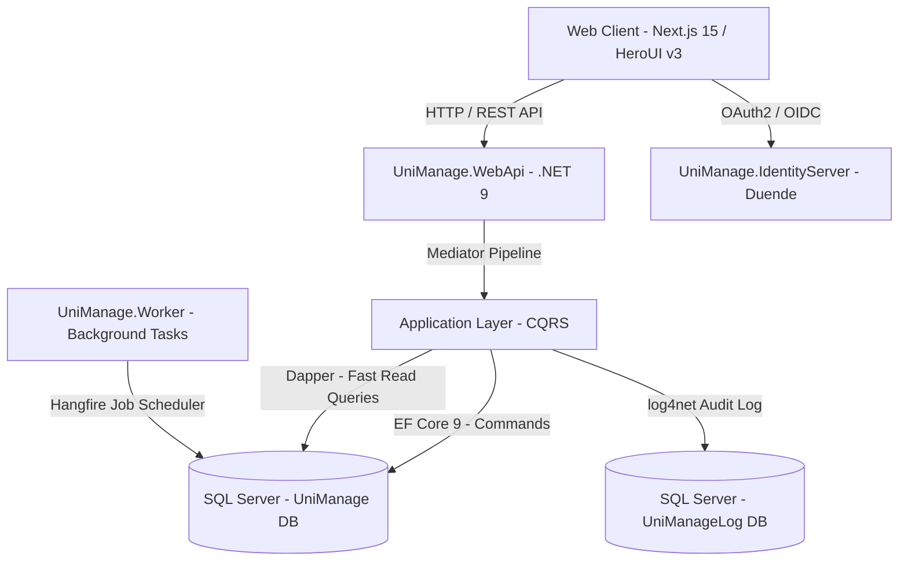
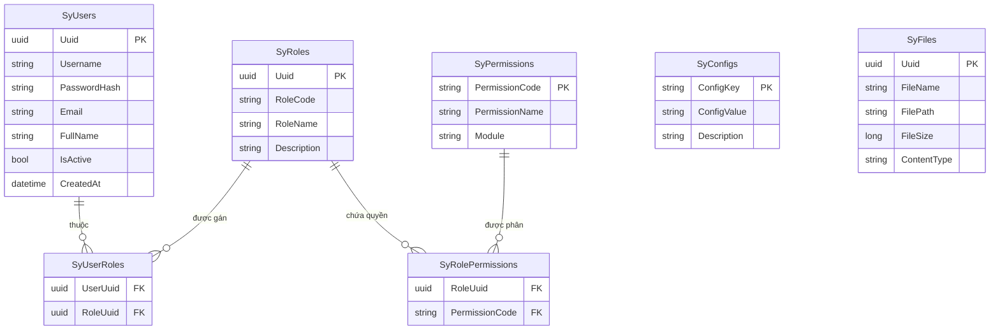
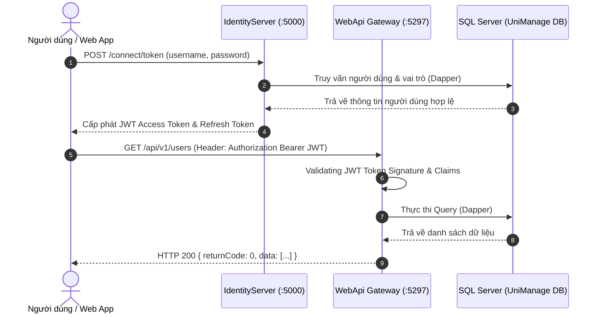

# Tài Liệu Thiết Kế Hệ Thống (System Design Document)

Tài liệu này mô tả thiết kế kiến trúc kỹ thuật chi tiết, sơ đồ thành phần, mô hình dữ liệu (ERD) và cơ chế vận hành của hệ thống UniManage.

---

## 1. Sơ Đồ Kiến Trúc Thành Phần (System Component Diagram)

Hệ thống UniManage bao gồm các thành phần chính tương tác với nhau:



### Chi Tiết Các Thành Phần:

1. **Next.js 15 Frontend**: Giao diện người dùng render trên Server (SSR) & Client, sử dụng HeroUI v3 component wrapper system.
2. **UniManage.WebApi**: RESTful Gateway tiếp nhận các yêu cầu từ Client, thực hiện xác thực Bearer JWT và phân tuyến qua MediatR.
3. **UniManage.IdentityServer**: Dịch vụ xác thực tập trung OAuth2/OpenID Connect cấp phát JWT Token.
4. **Clean Architecture & CQRS**: Phân tách luồng xử lý Command (Ghi/Sửa/Xóa qua EF Core) và Query (Đọc phân trang qua Dapper).
5. **UniManage.Worker**: Tiến trình chạy ngầm thực thi các Job định kỳ (gửi email, tính lương, dọn dẹp file rác) qua Hangfire.

---

## 2. Sơ Đồ Thực Thể Cơ Sở Dữ Liệu (Database ERD & Schema Design)

Mô hình dữ liệu cốt lõi của Module Hệ thống (System Module):



---

## 3. Sơ Đồ Luồng Xác Thực & Cấp Phát Token (Authentication Sequence Diagram)

Quy trình đăng nhập và tương tác API bảo mật sử dụng JWT Bearer Token:



---

## 4. Mô Hình Hybrid ORM (EF Core + Dapper)

Hệ thống tận dụng ưu điểm của cả 2 ORM hàng đầu:

```
                  ┌───────────────────────────────────────────┐
                  │          CQRS Mediated Requests           │
                  └─────────────────────┬─────────────────────┘
                                        │
                    ┌───────────────────┴───────────────────┐
                    ▼                                       ▼
        [ Commands (Write/Update) ]             [ Queries (Read Only) ]
                    │                                       │
        [ EF Core 9.0 DbContext ]               [ Dapper IDbConnection ]
                    │                                       │
      • Change Tracking                       • Raw SQL / Stored Procedures
      • Unit of Work & Transactions           • Fast Multimapping / Joins
      • Audit Logging via Behavior            • High Performance Pagination
                    │                                       │
                    └───────────────────┬───────────────────┘
                                        ▼
                            [( SQL Server Database )]
```
