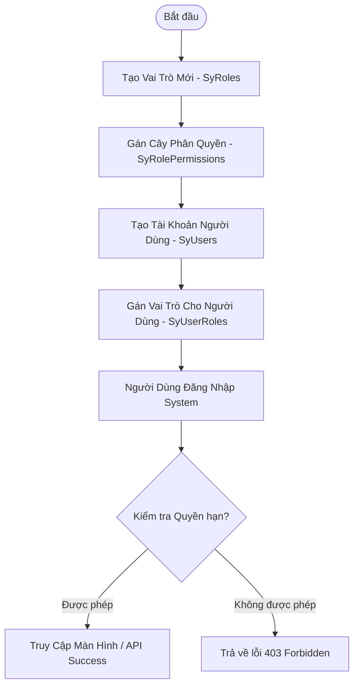

# Luồng Nghiệp Vụ Quản Trị Hệ Thống & Phân Quyền (System Management Flow)

Tài liệu này mô tả chi tiết quy trình nghiệp vụ quản lý tài khoản người dùng, phân quyền theo vai trò (RBAC) và thiết lập cấu hình hệ thống.

---

## 1. Sơ Đồ Quy Trình Phân Quyền (RBAC Flowchart)

---

## 2. Mô Tả Chi Tiết Các Bước Nghiệp Vụ

### 2.1. Quy Trình Khởi Tạo & Phân Quyền Tải Khoản
1. **Quản trị viên** tạo Vai trò công việc (ví dụ: `Kế toán Trưởng`, `Trưởng phòng Mua hàng`).
2. Chọn danh sách các chức năng (Permissions) cho vai trò đó trên cây phân quyền.
3. Khởi tạo tài khoản nhân viên mới và gán vai trò tương ứng.
4. Khi người dùng đăng nhập, IdentityServer đóng gói danh sách các quyền (`claims`) vào trong JWT Token.
5. `UniManage.WebApi` dựa trên Claims để chặn hoặc cho phép thực thi API.
