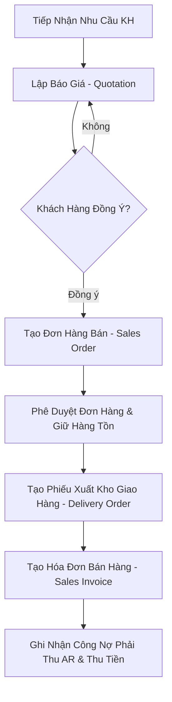

# Luồng Nghiệp Vụ Bán Hàng (Order-to-Cash / O2C Flow)

Tài liệu này mô tả chi tiết quy trình bán hàng toàn trình từ Báo giá ➔ Đơn hàng ➔ Giao hàng ➔ Hóa đơn ➔ Thu tiền.

---

## 1. Sơ Đồ Quy Trình Bán Hàng (Sales Flowchart)

---

## 2. Mô Tả Chi Tiết Các Bước Nghiệp Vụ

1. **Báo Giá (Quotation)**: NVKD lập báo giá gửi khách hàng dựa trên Bảng giá (Price List) và Chính sách chiết khấu.
2. **Đơn Hàng Bán (Sales Order - SO)**: Khi khách hàng duyệt báo giá, chuyển thành SO. Hệ thống kiểm tra hạn mức tín dụng (Credit Limit) của khách hàng.
3. **Giao Hàng (Delivery Order - DO)**: Bộ phận Kho nhận lệnh xuất hàng, đóng gói và giao cho đơn vị vận chuyển.
4. **Xuất Hóa Đơn (Sales Invoice)**: Kế toán bán hàng phát hành hóa đơn và ghi nhận doanh thu.
5. **Thu Tiền (Receipt)**: Kế toán công nợ theo dõi hạn thanh toán và ghi nhận chứng từ thu tiền.
