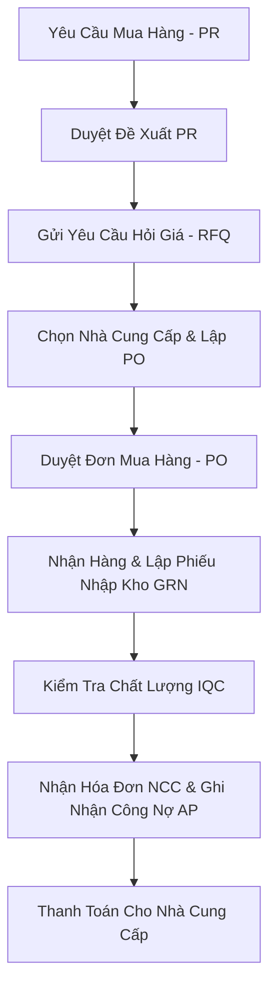

# Luồng Nghiệp Vụ Mua Hàng (Procure-to-Pay / P2P Flow)

Tài liệu này mô tả chi tiết quy trình mua hàng: Yêu cầu mua ➔ Đơn đặt mua ➔ Nhập kho ➔ Hóa đơn mua ➔ Thanh toán.

---

## 1. Sơ Đồ Quy Trình Mua Hàng (Procurement Flowchart)

---

## 2. Mô Tả Chi Tiết Các Bước Nghiệp Vụ

1. **Yêu Cầu Mua Hàng (Purchase Request - PR)**: Tạo bởi các bộ phận nghiệp vụ hoặc phát sinh tự động từ tính toán MRP.
2. **Đơn Đặt Mua Hàng (Purchase Order - PO)**: Phòng Mua hàng đàm phán giá và gửi PO cho Nhà cung cấp.
3. **Nhập Kho (Goods Receipt Note - GRN)**: Thủ kho kiểm đếm số lượng và lưu kho.
4. **Kiểm Tra Chất Lượng (IQC)**: Bộ phận QC kiểm tra chỉ tiêu kỹ thuật trước khi đưa vào sản xuất.
5. **Thanh Toán (AP Payment)**: Kế toán thanh toán khớp nối 3 bên (PO + GRN + Hóa đơn) và chi tiền.
