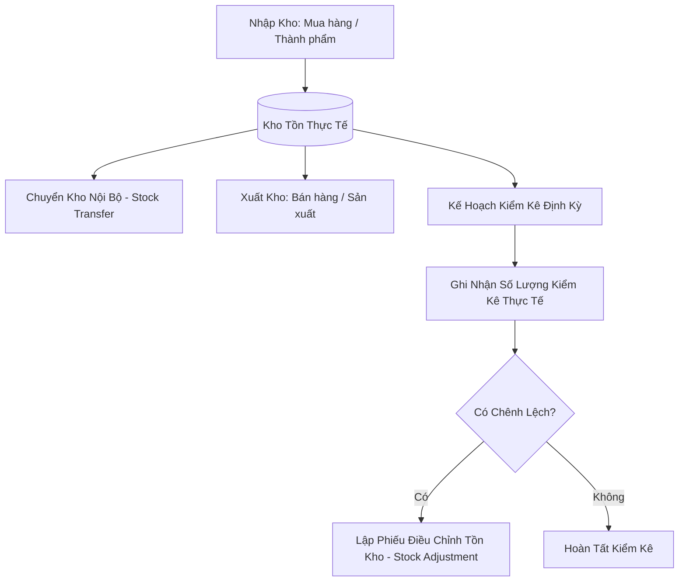

# Luồng Nghiệp Vụ Quản Lý Kho & Kiểm Kê (Inventory Flow)

Tài liệu mô tả các luồng nghiệp vụ quản lý kho: Nhập - Xuất - Chuyển kho nội bộ và Kiểm kê điều chỉnh tồn kho.

---

## 1. Sơ Đồ Quy Trình Quản Lý Kho (Inventory Flowchart)

