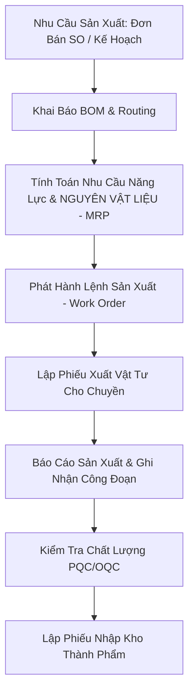

# Luồng Nghiệp Vụ Sản Xuất & MRP (Production Flow)

Tài liệu mô tả luồng nghiệp vụ sản xuất: Khai báo BOM ➔ Đánh giá tính toán vật tư MRP ➔ Lệnh sản xuất ➔ Xuất vật tư ➔ Nhập kho thành phẩm.

---

## 1. Sơ Đồ Quy Trình Sản Xuất (Production Flowchart)

